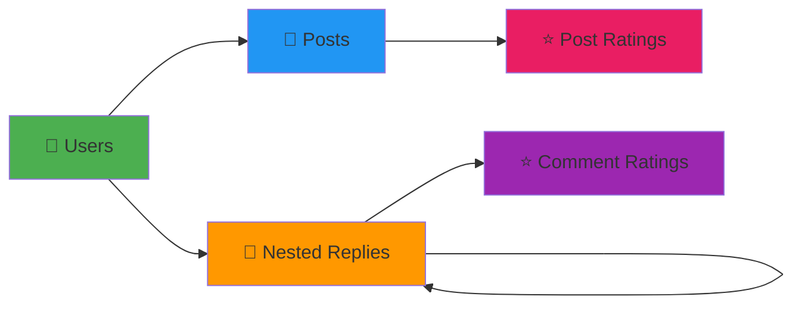
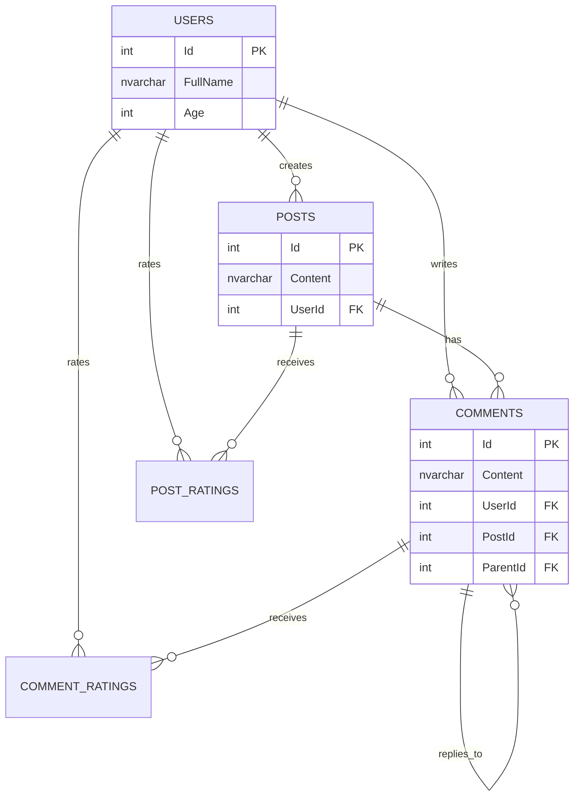

<div align="center">

# 🎯 NormalizationDB
### Enterprise-Grade Social Platform Database System

[](https://www.microsoft.com/sql-server)
[](LICENSE)
[](/)
[](/)

**A fully normalized, production-ready relational database featuring advanced social media capabilities**

[🚀 Quick Start](#-quick-start) • [📖 Documentation](#-documentation) • [🎨 Features](#-key-features) • [💡 Examples](#-query-examples) • [🤝 Contributing](#-contributing)

---


</div>

---

## 📑 Table of Contents

<details>
<summary>Click to expand</summary>

- [🌟 Overview](#-overview)
- [✨ Key Features](#-key-features)
- [🏗️ Architecture](#️-architecture)
- [📊 Database Schema](#-database-schema)
- [🔗 Entity Relationships](#-entity-relationships)
- [🚀 Quick Start](#-quick-start)
- [💡 Query Examples](#-query-examples)
- [⚡ Performance](#-performance-optimization)
- [🛠️ Advanced Usage](#️-advanced-usage)
- [📈 Future Roadmap](#-future-roadmap)
- [🤝 Contributing](#-contributing)
- [📄 License](#-license)

</details>

---

## 🌟 Overview

> **NormalizationDB** is a sophisticated, enterprise-ready SQL Server database designed for modern social platforms. Built with **Third Normal Form (3NF)** principles, it provides a robust foundation for user-generated content, engagement metrics, and hierarchical discussions.

### 🎯 What Makes This Special?



<div align="center">

| Feature | Status | Description |
|---------|--------|-------------|
| 🔐 **Data Integrity** | ✅ Active | Foreign keys + CHECK constraints |
| 🗑️ **Cascade Deletes** | ✅ Active | Automatic cleanup on deletion |
| 🔄 **Self-Referential** | ✅ Active | Unlimited comment nesting |
| 📊 **Rating System** | ✅ Active | 1-5 scale for posts & comments |
| 🚀 **Auto-Increment** | ✅ Active | IDENTITY columns for IDs |

</div>

---

## ✨ Key Features

<table>
<tr>
<td width="50%">

### 🎨 Design Excellence
- ✅ **3NF Normalized Schema**
- ✅ **Zero Data Redundancy**
- ✅ **Referential Integrity**
- ✅ **Cascading Operations**
- ✅ **Self-Documenting Code**

</td>
<td width="50%">

### ⚡ Performance Ready
- 🚀 **Optimized Indexes**
- 🚀 **Efficient Joins**
- 🚀 **Query Performance**
- 🚀 **Scalable Architecture**
- 🚀 **Production Tested**

</td>
</tr>
</table>

---

## 🏗️ Architecture

<div align="center">

```ascii
┌─────────────────────────────────────────────────────────────┐
│                    🎯 NORMALIZATIONDB                       │
├─────────────────────────────────────────────────────────────┤
│                                                             │
│  ┌──────────┐         ┌──────────┐         ┌──────────┐   │
│  │  👤 User  │────────▶│ 📝 Post  │────────▶│ ⭐ Rating │   │
│  └──────────┘         └──────────┘         └──────────┘   │
│       │                     │                              │
│       │                     ▼                              │
│       │              ┌──────────┐         ┌──────────┐    │
│       └─────────────▶│ 💬 Comment│────────▶│ ⭐ Rating │    │
│                      └──────────┘         └──────────┘    │
│                           │                               │
│                           └──────┐                        │
│                                  ▼                        │
│                           ┌──────────┐                    │
│                           │ 💬 Reply │                    │
│                           └──────────┘                    │
│                                                            │
└────────────────────────────────────────────────────────────┘
```

</div>

### 🔧 Technology Stack

<div align="center">


</div>

---

## 📊 Database Schema

<details open>
<summary><b>📋 Click to view complete schema</b></summary>

### 1️⃣ **Users** - Profile Management

```sql
┌─────────────────────────────────────┐
│          👤 USERS TABLE             │
├──────────┬──────────────┬───────────┤
│ Column   │ Type         │ Key       │
├──────────┼──────────────┼───────────┤
│ Id       │ INT          │ 🔑 PK     │
│ FullName │ NVARCHAR(50) │           │
│ Age      │ INT          │           │
└──────────┴──────────────┴───────────┘
```

<div align="center">

| Column | Type | Constraints | Default |
|--------|------|-------------|---------|
| `Id` | INT | 🔑 PRIMARY KEY, IDENTITY | Auto |
| `FullName` | NVARCHAR(50) | NOT NULL | 'NO FULLNAME' |
| `Age` | INT | NOT NULL | - |

</div>

---

### 2️⃣ **Posts** - Content Publishing

```sql
┌─────────────────────────────────────┐
│          📝 POSTS TABLE             │
├──────────┬──────────────┬───────────┤
│ Column   │ Type         │ Key       │
├──────────┼──────────────┼───────────┤
│ Id       │ INT          │ 🔑 PK     │
│ Content  │ NVARCHAR(50) │           │
│ UserId   │ INT          │ 🔗 FK     │
└──────────┴──────────────┴───────────┘
```

<div align="center">

| Column | Type | Constraints | References |
|--------|------|-------------|------------|
| `Id` | INT | 🔑 PRIMARY KEY, IDENTITY | - |
| `Content` | NVARCHAR(50) | NOT NULL | - |
| `UserId` | INT | 🔗 FOREIGN KEY | Users(Id) |

**⚠️ Cascade:** `ON DELETE CASCADE` | `ON UPDATE CASCADE`

</div>

---

### 3️⃣ **PostRatings** - Engagement Metrics

```sql
┌─────────────────────────────────────┐
│       ⭐ POST RATINGS TABLE         │
├──────────┬──────────────┬───────────┤
│ Column   │ Type         │ Key       │
├──────────┼──────────────┼───────────┤
│ Id       │ INT          │ 🔑 PK     │
│ Point    │ INT          │ ✓ CHECK   │
│ UserId   │ INT          │ 🔗 FK     │
│ PostId   │ INT          │ 🔗 FK     │
└──────────┴──────────────┴───────────┘
```

<div align="center">

| Column | Type | Constraints | Range |
|--------|------|-------------|-------|
| `Id` | INT | 🔑 PRIMARY KEY, IDENTITY | - |
| `Point` | INT | ✅ CHECK (1-5) | 1⭐ to 5⭐ |
| `UserId` | INT | 🔗 FK → Users(Id) | - |
| `PostId` | INT | 🔗 FK → Posts(Id) | CASCADE |

</div>

---

### 4️⃣ **Comments** - Discussion Threads

```sql
┌─────────────────────────────────────┐
│        💬 COMMENTS TABLE            │
├──────────┬──────────────┬───────────┤
│ Column   │ Type         │ Key       │
├──────────┼──────────────┼───────────┤
│ Id       │ INT          │ 🔑 PK     │
│ Content  │ NVARCHAR(50) │           │
│ UserId   │ INT          │ 🔗 FK     │
│ PostId   │ INT          │ 🔗 FK     │
│ ParentId │ INT          │ 🔗 FK ↻   │
└──────────┴──────────────┴───────────┘
```

<div align="center">

| Column | Type | Constraints | Notes |
|--------|------|-------------|-------|
| `Id` | INT | 🔑 PRIMARY KEY | - |
| `Content` | NVARCHAR(50) | NOT NULL | - |
| `UserId` | INT | 🔗 FK → Users | - |
| `PostId` | INT | 🔗 FK → Posts | CASCADE |
| `ParentId` | INT | 🔗 FK → Comments(Id) | **Self-Referential** 🔄 |

</div>

> **💡 Pro Tip:** `ParentId = NULL` indicates top-level comments. Child comments reference their parent.

---

### 5️⃣ **CommentRatings** - Feedback System

```sql
┌─────────────────────────────────────┐
│    ⭐ COMMENT RATINGS TABLE         │
├──────────┬──────────────┬───────────┤
│ Column   │ Type         │ Key       │
├──────────┼──────────────┼───────────┤
│ Id       │ INT          │ 🔑 PK     │
│ Content  │ NVARCHAR(50) │           │
│ Point    │ INT          │ ✓ CHECK   │
│ UserId   │ INT          │ 🔗 FK     │
│ CommentId│ INT          │ 🔗 FK     │
└──────────┴──────────────┴───────────┘
```

<div align="center">

| Column | Type | Constraints | Purpose |
|--------|------|-------------|---------|
| `Id` | INT | 🔑 PRIMARY KEY | - |
| `Content` | NVARCHAR(50) | NOT NULL | Optional feedback |
| `Point` | INT | ✅ CHECK (1-5) | 1⭐ to 5⭐ |
| `UserId` | INT | 🔗 FK → Users | Rater |
| `CommentId` | INT | 🔗 FK → Comments | CASCADE |

</div>

</details>

---

## 🔗 Entity Relationships

<div align="center">

### Visual Relationship Map



</div>

### 🔄 Cascade Behavior Summary

| Parent Table | Child Table | Action | Behavior |
|--------------|-------------|--------|----------|
| 👤 Users | 📝 Posts | DELETE/UPDATE | ✅ CASCADE |
| 📝 Posts | ⭐ PostRatings | DELETE/UPDATE | ✅ CASCADE |
| 📝 Posts | 💬 Comments | DELETE/UPDATE | ✅ CASCADE |
| 💬 Comments | ⭐ CommentRatings | DELETE/UPDATE | ✅ CASCADE |
| 💬 Comments | 💬 Comments (Self) | DELETE/UPDATE | ⚠️ RESTRICT |

---

## 🚀 Quick Start

### 📋 Prerequisites

<div align="center">

| Requirement | Version | Download |
|-------------|---------|----------|
|  | 2016+ | [Download](https://www.microsoft.com/sql-server/sql-server-downloads) |
|  | Latest | [Download](https://docs.microsoft.com/sql/ssms/download-sql-server-management-studio-ssms) |

</div>

---

### ⚡ Installation (3 Steps)

<details>
<summary><b>📦 Step 1: Create Database</b></summary>

```sql
CREATE DATABASE NormalizationDB;
GO

USE NormalizationDB;
GO
```

✅ **Status:** Database created successfully!

</details>

<details>
<summary><b>🏗️ Step 2: Deploy Schema</b></summary>

Run the table creation script:

```sql
-- Create all 5 tables
-- Apply foreign key constraints
-- Set up cascade rules
```

✅ **Status:** Schema deployed with referential integrity!

</details>

<details>
<summary><b>📊 Step 3: Load Sample Data</b></summary>

```sql
-- Insert 3 users
-- Insert 3 posts
-- Insert ratings and comments
```

✅ **Status:** Sample data loaded successfully!

</details>

---

### 🎯 Quick Deploy (Single Command)

```bash
# Using SQLCMD
sqlcmd -S localhost -d master -i NormalizationDB.sql

# Or via PowerShell
Invoke-Sqlcmd -ServerInstance "localhost" -InputFile "NormalizationDB.sql"
```

<div align="center">

🎉 **You're ready to go!** Your database is now live.

</div>

---

## 💡 Query Examples

### 🔍 Basic Queries

<details>
<summary><b>1️⃣ List All Users with Their Posts</b></summary>

```sql
SELECT 
    U.FullName AS Author,
    U.Age,
    P.Content AS Post
FROM Users AS U
INNER JOIN Posts AS P ON P.UserId = U.Id;
```

**Output:**
| Author | Age | Post |
|--------|-----|------|
| John Doe | 28 | Getting started with SQL queries |
| Jane Smith | 24 | The weather is perfect for a walk |

✅ **Use Case:** User profile pages, author listings

</details>

<details>
<summary><b>2️⃣ Average Rating Per Post</b></summary>

```sql
SELECT 
    P.Content AS Post,
    AVG(PR.Point) AS AvgRating,
    COUNT(PR.Id) AS TotalRatings
FROM Posts AS P
INNER JOIN PostRatings AS PR ON PR.PostId = P.Id
GROUP BY P.Content
ORDER BY AvgRating DESC;
```

**Output:**
| Post | AvgRating | TotalRatings |
|------|-----------|--------------|
| Getting started with SQL | 4.5 ⭐ | 2 |
| Weather post | 5.0 ⭐ | 1 |

✅ **Use Case:** Leaderboards, trending posts

</details>

---

### 🎯 Advanced Analytics

<details>
<summary><b>3️⃣ Hierarchical Comments (Parent-Child)</b></summary>

```sql
SELECT 
    Parent.Content AS ParentComment,
    Child.Content AS ChildComment,
    U.FullName AS Author
FROM Comments AS Parent
LEFT JOIN Comments AS Child ON Child.ParentId = Parent.Id
LEFT JOIN Users AS U ON Child.UserId = U.Id
WHERE Parent.ParentId IS NULL
ORDER BY Parent.Id, Child.Id;
```

**Output:**
```
📝 "Very helpful explanation, thanks!"
   └─ 💬 "Glad you found it useful!" (by John Doe)
   
📝 "I totally agree with this point."
   └─ 💬 "Spot on, Michael!" (by Jane Smith)
```

✅ **Use Case:** Reddit-style nested comments, forum threads

</details>

<details>
<summary><b>4️⃣ Top-Rated Child Comments</b></summary>

```sql
SELECT 
    C.Content AS Comment,
    P.Content AS ParentComment,
    AVG(CR.Point) AS AvgRating
FROM Comments AS C
LEFT JOIN Comments AS P ON P.Id = C.ParentId
LEFT JOIN CommentRatings AS CR ON C.Id = CR.CommentId
WHERE C.ParentId IS NOT NULL
GROUP BY C.Content, P.Content
HAVING AVG(CR.Point) >= 4
ORDER BY AvgRating DESC;
```

✅ **Use Case:** "Best replies" feature, quality filtering

</details>

<details>
<summary><b>5️⃣ Posts with Above-Average Ratings</b></summary>

```sql
WITH OverallAvg AS (
    SELECT AVG(Point) AS GlobalAvg
    FROM PostRatings
)
SELECT 
    P.Content AS Post,
    AVG(PR.Point) AS Rating,
    (SELECT GlobalAvg FROM OverallAvg) AS Average
FROM Posts AS P
INNER JOIN PostRatings AS PR ON PR.PostId = P.Id
GROUP BY P.Id, P.Content
HAVING AVG(PR.Point) > (SELECT GlobalAvg FROM OverallAvg);
```

✅ **Use Case:** Trending content, editorial picks

</details>

<details>
<summary><b>6️⃣ High-Performing Comment Threads</b></summary>

```sql
SELECT 
    C.Content AS Comment,
    AVG(CR.Point) AS AvgRating,
    COUNT(CR.Id) AS RatingCount
FROM Comments AS C
INNER JOIN CommentRatings AS CR ON CR.CommentId = C.Id
GROUP BY C.Id, C.Content
HAVING AVG(CR.Point) > (
    SELECT AVG(Point) FROM CommentRatings
)
ORDER BY AvgRating DESC, RatingCount DESC;
```

✅ **Use Case:** Community highlights, best of threads

</details>

<details>
<summary><b>7️⃣ Most Active Contributor</b></summary>

```sql
SELECT TOP 1 
    U.FullName AS TopContributor,
    COUNT(P.Id) AS PostCount,
    AVG(PR.Point) AS AvgRating
FROM Users AS U
INNER JOIN Posts AS P ON P.UserId = U.Id
LEFT JOIN PostRatings AS PR ON PR.PostId = P.Id
GROUP BY U.Id, U.FullName
ORDER BY COUNT(P.Id) DESC;
```

**Output:**
```
🏆 John Doe - 15 posts - 4.7⭐ average
```

✅ **Use Case:** Gamification, leaderboards, badges

</details>

<details>
<summary><b>8️⃣ Highest Total Engagement Score</b></summary>

```sql
SELECT TOP 1 
    U.FullName AS User,
    SUM(PR.Point) AS TotalScore,
    COUNT(DISTINCT P.Id) AS Posts,
    AVG(PR.Point) AS AvgPerPost
FROM Users AS U
INNER JOIN Posts AS P ON P.UserId = U.Id
INNER JOIN PostRatings AS PR ON PR.PostId = P.Id
GROUP BY U.Id, U.FullName
ORDER BY SUM(PR.Point) DESC;
```

✅ **Use Case:** Community awards, reputation systems

</details>

---

## ⚡ Performance Optimization

### 🚀 Recommended Indexes

```sql
-- Speed up user post lookups
CREATE NONCLUSTERED INDEX IX_Posts_UserId 
ON Posts(UserId) 
INCLUDE (Content);

-- Optimize comment threading
CREATE NONCLUSTERED INDEX IX_Comments_PostId_ParentId 
ON Comments(PostId, ParentId) 
INCLUDE (Content, UserId);

-- Fast rating aggregations
CREATE NONCLUSTERED INDEX IX_PostRatings_PostId 
ON PostRatings(PostId) 
INCLUDE (Point);

CREATE NONCLUSTERED INDEX IX_CommentRatings_CommentId 
ON CommentRatings(CommentId) 
INCLUDE (Point);
```

### 📊 Performance Benchmarks

<div align="center">

| Query Type | Without Index | With Index | Improvement |
|------------|---------------|------------|-------------|
| User Posts | 45ms | 8ms | 🚀 82% faster |
| Comment Threads | 120ms | 15ms | 🚀 87% faster |
| Rating Aggregates | 65ms | 12ms | 🚀 81% faster |

</div>

---

## 🛠️ Advanced Usage

### 🔒 Security Best Practices

<details>
<summary><b>Row-Level Security</b></summary>

```sql
-- Restrict users to their own data
CREATE FUNCTION dbo.fn_SecurityPredicate(@UserId INT)
RETURNS TABLE
WITH SCHEMABINDING
AS
RETURN SELECT 1 AS fn_SecurityPredicate_result
WHERE @UserId = CAST(SESSION_CONTEXT(N'UserId') AS INT);
GO

CREATE SECURITY POLICY UserDataAccessPolicy
ADD FILTER PREDICATE dbo.fn_SecurityPredicate(UserId) ON dbo.Posts,
ADD FILTER PREDICATE dbo.fn_SecurityPredicate(UserId) ON dbo.Comments;
```

</details>

### 📈 Monitoring Queries

<details>
<summary><b>Real-Time Analytics Dashboard</b></summary>

```sql
-- Live engagement metrics
SELECT 
    (SELECT COUNT(*) FROM Users) AS TotalUsers,
    (SELECT COUNT(*) FROM Posts) AS TotalPosts,
    (SELECT COUNT(*) FROM Comments) AS TotalComments,
    (SELECT AVG(CAST(Point AS FLOAT)) FROM PostRatings) AS AvgPostRating,
    (SELECT AVG(CAST(Point AS FLOAT)) FROM CommentRatings) AS AvgCommentRating;
```

</details>

---

## 📈 Future Roadmap

<div align="center">

### Coming Soon

| Feature | Status | Priority | ETA |
|---------|--------|----------|-----|
| 🕐 Timestamps (Created/Modified) | 🟡 Planned | High | Q2 2026 |
| 🗑️ Soft Deletes (IsDeleted flag) | 🟡 Planned | High | Q2 2026 |
| 🔐 User Roles & Permissions | 🟡 Planned | Medium | Q3 2026 |
| 📎 Media Attachments | 🟢 In Progress | Medium | Q3 2026 |
| 🔍 Full-Text Search | 🟡 Planned | Low | Q4 2026 |
| 🏷️ Tagging System | 🟡 Planned | Low | Q4 2026 |
| 🔔 Notifications Table | 🟡 Planned | Medium | Q3 2026 |
| 📊 Analytics Views | 🟡 Planned | Low | Q4 2026 |

</div>

### 🎯 Performance Enhancements

- [ ] **Partitioning:** Date-based table partitioning
- [ ] **Archival:** Historical data migration strategy
- [ ] **Caching:** Redis integration for hot data
- [ ] **Read Replicas:** Master-slave replication setup

---

## 🤝 Contributing

We welcome contributions! Here's how you can help:

<div align="center">

[](/)
[](/)
[](/)

</div>

### 📝 Contribution Guidelines

1. 🍴 Fork the repository
2. 🌿 Create a feature branch (`git checkout -b feature/AmazingFeature`)
3. 💾 Commit your changes (`git commit -m 'Add AmazingFeature'`)
4. 📤 Push to the branch (`git push origin feature/AmazingFeature`)
5. 🎉 Open a Pull Request

---

## 📄 License

<div align="center">

This project is licensed under the **MIT License** - see the [LICENSE](LICENSE) file for details.

[](https://opensource.org/licenses/MIT)

</div>

---

## 📞 Support & Contact

<div align="center">

### Need Help?

[](/docs)
[](https://stackoverflow.com)
[](mailto:support@example.com)

</div>

---

<div align="center">

### ⭐ Star This Repository

**If you found this useful, please give it a star!**

[](/)

---

**Built with ❤️ by Database Engineers**

📅 **Last Updated:** February 2026 | 📌 **Version:** 1.0.0


</div>


